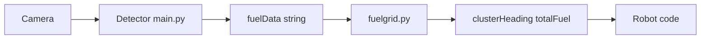

# FuelDetector

Real-time vision for FRC: find game pieces (“fuel”) in the camera image, publish detections over **NetworkTables**, and compute a **heading** toward the densest cluster so the robot can drive or aim toward a pile.

**Typical use:** Raspberry Pi 5 + **AI Kit (Hailo)** on the robot runs `main.py` + `fuelgrid.py`. Driver station / roboRIO runs the NetworkTables server; robot code reads `clusterHeading` and `totalFuel`.

---

## How this README is organized

| Section | What you’ll find |
|--------|-------------------|
| [Architecture overview](#architecture-overview) | Pictures and vocabulary: detector vs cluster stage, NT topics |
| [Repository layout](#repository-layout) | What each important file or folder is for |
| [Requirements and setup](#requirements-and-setup) | What to install before you run anything |
| [How to run](#how-to-run) | Copy-paste commands for Pi AI Kit and for laptop debug |
| [Run automatically at boot (Pi)](#run-automatically-at-boot-pi) | Link to systemd / autostart guide |
| [NetworkTables reference](#networktables-reference) | Table and topic names |
| [Tuning and operational notes](#tuning-and-operational-notes) | Thresholds, grid size, camera assumptions |
| [Performance improvement ideas](#performance-improvement-ideas) | Levers to try when you need speed or smoother control |
| [Troubleshooting](#troubleshooting) | Common failures and what to check |
| [Repository status](#repository-status) | Dependencies and lockfiles |

---

## Architecture overview

### Two programs, one pipeline

FuelDetector splits work into **two processes** that talk only through NetworkTables (so they can run on the same Pi or be split later if you redesign):

1. **Detector** (`main.py` on Pi AI Kit, or `visual.py` / `rpi.py` for experiments)  
   Camera → neural network → list of boxes → serialized string on NT.

2. **Cluster processor** (`fuelgrid.py`)  
   Reads that string, treats detections as points on a 2D grid, finds the **largest connected cluster**, converts it to a **heading in degrees**, publishes heading + fuel count.

Both programs call `ntinit.getNT(...)` so they join the same NT **client** convention (robot at `10.27.13.2`, then localhost fallback). See [ntinit.py](ntinit.py).

### Data flow (conceptual)



### What travels on NetworkTables

- **`fuelData`** — One string per frame: semicolon-separated detections; each detection is `x_center,y_center,width,height,confidence` in **pixels** (pipeline assumes **640×480** geometry in `fuelgrid.py`).
- **`clusterHeading`** — Double: degrees to turn toward the largest cluster (sign convention is defined in `fuelgrid.py`).
- **`totalFuel`** — Integer: accepted detection count for that frame (after confidence filtering).

---

## Repository layout

**Entry points (Python, repo root)**

| File | Role |
|------|------|
| [main.py](main.py) | **Competition path:** Hailo + GStreamer + USB camera → publishes `fuelData`. Pi AI Kit. |
| [fuelgrid.py](fuelgrid.py) | Subscribes `fuelData`, publishes `clusterHeading` / `totalFuel`. |
| [ntinit.py](ntinit.py) | NetworkTables client bootstrap (robot IP, localhost). |
| [fuelcluster.py](fuelcluster.py) | Data structure for merged grid cells (`fuel_count`, average position). |
| [visual.py](visual.py) | **Debug:** Ultralytics + OpenCV window; laptop / webcam; publishes `fuelData`. |
| [rpi.py](rpi.py) | **Debug / alternate:** Pi CSI camera + Ultralytics; publishes `fuelData`. |

**Models and config (often at repo root)**

- `yolov11n.hef` — Hailo compiled model for `main.py` (build or copy per your team).
- `best302.pt` — Ultralytics weights for `visual.py` / `rpi.py`.
- `data.yaml`, Roboflow README stubs — dataset / training metadata (see `dataset/`).

**Folders**

- `docs/` — Extra guides; includes **[Pi boot / systemd autostart](docs/PI_BOOT_AUTOSTART.md)**.
- `dataset/` — Training images and labels (large; not required on the robot at runtime).

---

## Requirements and setup

- **Python 3.11+** recommended.  
- A running **NetworkTables server** (roboRIO + driver station, or a local NT server for testing).

### Pi AI Kit — `main.py` (recommended on the coprocessor)

1. Install the **Hailo** stack for Raspberry Pi ([Hailo RPi5 examples](https://github.com/hailo-ai/hailo-rpi5-examples) or [hailo-apps](https://github.com/hailo-ai/hailo-apps)): `hailo` Python module, GStreamer plugins, `setup_env.sh`.
2. Place **`yolov11n.hef`** in the repo root (or pass `--hef-path`).
3. USB camera (default `/dev/video0`, or `--input` / `usb`).

In a shell where you have sourced Hailo’s environment:

```bash
pip install ntcore   # if not already in that venv
```

You normally need: **`ntcore`**, **PyGObject (`gi`)**, **Hailo `hailo_apps`** (see upstream docs).

**Useful environment variables** (also see `main.py` `--help`):

| Variable | Purpose |
|----------|---------|
| `HAILO_ENV_FILE` | Path to Hailo `.env` |
| `FUEL_HEF_PATH` | Default `.hef` path |
| `FUEL_CAMERA` | Default camera device or `usb` |
| `FUEL_FRAME_WIDTH` / `FUEL_FRAME_HEIGHT` / `FUEL_FRAME_RATE` | Capture size and FPS |
| `FUEL_TRACKER_CLASS_ID` | `-1` = all classes; `0` typical for single-class models |

### Laptop / Ultralytics — `visual.py` or `rpi.py`

```bash
python3 -m venv .venv
source .venv/bin/activate
pip install --upgrade pip
pip install ultralytics ntcore opencv-python
# Pi CSI camera only:
pip install picamera2
```

Put **`best302.pt`** in the repo root for Ultralytics scripts.

---

## How to run

You always run **two terminals** (or two services): **detector** and **`fuelgrid.py`**.

### 1. Detector

**Pi AI Kit (Hailo + USB):**

```bash
source /path/to/hailo-rpi5-examples/setup_env.sh   # or your hailo-apps setup
cd /path/to/FuelDetector
python main.py
```

Useful options:

```bash
python main.py --input /dev/video1 --hef-path ./yolov11n.hef --no-headless
```

- Default is **`--headless`** (`fakesink`): no display, good for a coprocessor.
- **`--no-headless`**: show video on a monitor (debug).

**Laptop / webcam:**

```bash
python visual.py
```

**Pi with CSI camera (Ultralytics):**

```bash
python rpi.py
```

### 2. Cluster processor (second terminal)

Same machine as the detector (typical on the Pi):

```bash
cd /path/to/FuelDetector
python fuelgrid.py
```

Use the **same** Python environment that has **`ntcore`** installed (often the Hailo venv if that’s where you installed it).

`fuelgrid.py` publishes **`clusterHeading`** and **`totalFuel`** continuously from the latest `fuelData`.

---

## Run automatically at boot (Pi)

To start **`main.py`** and **`fuelgrid.py`** on power-up without logging in (systemd, wrapper script, `/etc/default` config), follow the step-by-step guide:

**[docs/PI_BOOT_AUTOSTART.md](docs/PI_BOOT_AUTOSTART.md)**

---

## NetworkTables reference

**Table:** `fuelDetector`

| Topic | Type | Publisher |
|-------|------|-----------|
| `fuelData` | string | Detector (`main.py`, `visual.py`, `rpi.py`) |
| `clusterHeading` | double | `fuelgrid.py` |
| `totalFuel` | integer | `fuelgrid.py` |
| `robotConnected` | boolean | Expected from **robot / server** (used in `ntinit.py` to pick server address) |

---

## Tuning and operational notes

These knobs change behavior without retraining:

- **Confidence filter:** `FuelGrid.fuel_chance_threshold` in [fuelgrid.py](fuelgrid.py) (default `0.75`).
- **Grid and FOV:** Constructor `FuelGrid(12, 12, 60)` in [fuelgrid.py](fuelgrid.py) — grid resolution and horizontal FOV in degrees (for heading math).
- **Geometry:** `FuelGrid.image_width` / `image_height` default **640** / **480**; if you change capture size in `main.py`, update `fuelgrid.py` to match or headings will be wrong.
- **NT addressing:** [ntinit.py](ntinit.py) tries **`10.27.13.2`**, then **`127.0.0.1`** based on `robotConnected`.

---

## Performance improvement ideas

Use this as a checklist when latency is high, CPU is maxed, or headings feel sluggish. **Measure** (loop time, NT publish rate, camera FPS) before and after changes.

**Inference and pipeline (`main.py`, Hailo path)**

- **Resolution:** Lower width/height can reduce NPU and USB load. If you change it, update `fuelgrid.py` image dimensions and revalidate heading accuracy.
- **Frame rate:** Lower `--frame-rate` / `FUEL_FRAME_RATE` if the rest of the stack cannot keep up (reduces work and bandwidth).
- **Headless coprocessor:** Stay headless on the robot; preview mode uses a smaller bypass queue in code paths meant for display, but headless is still the right default for competition.
- **Tracker class:** For a single-class model, `--tracker-class-id 0` (or env) avoids extra tracker work on irrelevant classes.
- **Model:** A smaller/faster `.hef` may trade accuracy for FPS (team decision; recompile / retrain as needed).

**Clustering (`fuelgrid.py`)**

- **Grid size:** A coarser grid (fewer cells) is cheaper CPU and may be enough for “find the big pile”; finer grid costs more per frame.
- **Thresholds:** Higher `fuel_chance_threshold` reduces false positives but may drop faint detections; tune from logged frames.

**System and I/O**

- **USB:** Use a short, quality cable; a powered hub can help if the Pi brownouts the camera.
- **Thermal / power:** Throttling from heat or weak supply shows up as uneven FPS; fix cooling and power before chasing software.
- **Network:** Ensure the vision Pi and roboRIO are on a stable segment; NT flapping hurts any closed-loop use of `clusterHeading`.

**Software follow-ups (not implemented here)**

- Configurable robot IP (today fixed in `ntinit.py`) for multi-environment testing.
- Throttle or coalesce `fuelData` publishes if NT string size or rate becomes an issue (measure first).

---

## Troubleshooting

- **No NetworkTables connection**  
  Check `10.27.13.2`, subnet, and firewall. Confirm `robotConnected` is published as your robot code expects.

- **No detections (Hailo)**  
  Verify `.hef` path, camera device (`v4l2-ctl --list-devices`), source `setup_env.sh`, `HAILO_ENV_FILE` / TAPPAS paths. Try `--tracker-class-id 0` for single-class models.

- **No detections (Ultralytics)**  
  Confirm `best302.pt` exists and camera index matches.

- **No heading updates**  
  Ensure `fuelgrid.py` is running. Inspect `fuelData` in Glass, AdvantageScope, or your NT viewer.

- **`main.py` import errors**  
  Use the Hailo examples / `hailo-apps` Python environment with `hailo`, GStreamer `gi`, and `hailo_apps`.

- **`rpi.py` quirks**  
  CSI capture order can vary by OS; validate on your hardware.

---

## Repository status

There is no checked-in lockfile or single `requirements.txt` covering every path; install dependencies manually as in [Requirements and setup](#requirements-and-setup).
